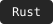
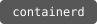

  

  
<strong>Building reliable services, from runtime to infrastructure.</strong>

  
  

### 👋 About Me

你好，我是 **wenmou**。关注 **Go 后端、Rust 开发、Agent Runtime 与云原生平台**。

我喜欢把服务研发和基础设施实践连起来：从沙箱生命周期、并发执行与故障恢复，到 Kubernetes、GitOps 交付和可观测性。

### 🛠 Tech Stack

**Languages**

**OS**

**Backend & API**

**Cloud Native & Networking**

**Sandbox**

**Automation & GitOps**

**Data & Storage**

**Observability**

**Web**

**Testing & Performance**

### 📄 Research & Side Projects

- **ICASSP 2026 第一作者**：隐私保护感知哈希与零知识相似度验证，基于 Rust 实现。[Paper](https://doi.org/10.1109/ICASSP55912.2026.11461525) · [Code](https://github.com/mengdehong/zkph)
- **[AnimeShelf](https://github.com/mengdehong/AnimeShelf)**：使用 Flutter 开发的本地优先番剧记录与分级管理应用。

---

Go / Rust · Linux · Reliable Systems

